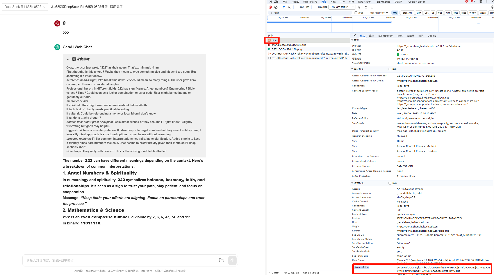

# GenAI2OpenAI

OpenAI 兼容的代理服务，将上海科技大学 GenAI 平台的 API 转换为标准 OpenAI Chat Completion 接口，支持 tool calling。

## 安装与运行

### 环境要求

- Python 3.11+
- 推荐使用 [uv](https://github.com/astral-sh/uv) 管理环境

### 启动服务

```bash
uv run main.py --token <token> [--port 5000] [--api-key <key>] [--debug]
```

| 参数 | 说明 | 默认值 |
|------|------|--------|
| `--token` | GenAI 平台的访问令牌（必需） | — |
| `--port` | 服务监听端口 | `5000` |
| `--api-key` | 客户端认证密钥（也可通过 `API_KEY` 环境变量设置） | 无（不校验） |
| `--debug` | 启用详细日志输出 | 关闭 |

## 功能

### OpenAI 兼容接口

- `POST /v1/chat/completions` — 聊天补全（流式/非流式）
- `GET /v1/models` — 列出可用模型
- `GET /health` — 健康检查

### Tool Calling

支持 OpenAI 格式的 tool calling，通过 prompt 注入实现，兼容不原生支持 function calling 的模型。

```python
from openai import OpenAI

client = OpenAI(
    base_url="http://localhost:5000/v1",
    api_key="your-api-key"  # 如果设置了 --api-key
)

response = client.chat.completions.create(
    model="GPT-4.1",
    messages=[{"role": "user", "content": "北京今天天气怎么样？"}],
    tools=[{
        "type": "function",
        "function": {
            "name": "get_weather",
            "description": "获取指定城市的天气信息",
            "parameters": {
                "type": "object",
                "properties": {
                    "city": {"type": "string", "description": "城市名称"}
                },
                "required": ["city"]
            }
        }
    }]
)
```

支持 `tool_choice` 参数：`"auto"`（默认）、`"required"`、指定函数名。

### API Key 认证

设置 `--api-key` 或环境变量 `API_KEY` 后，所有 `/v1/` 请求需要携带 `Authorization: Bearer <key>` 请求头。未设置时跳过认证（开发模式）。

### 支持的模型

| 模型 | 后端类型 |
|------|----------|
| `GPT-5` | Azure |
| `GPT-4.1` | Azure |
| `GPT-4.1-mini` | Azure |
| `o4-mini` | Azure |
| `o3` | Azure |
| `deepseek-v3:671b` | Xinference |
| `deepseek-r1:671b` | Xinference |
| `qwen-instruct` | Xinference |
| `qwen-think` | Xinference |

## Token 获取

1. 前往 [GenAI 对话平台](https://genai.shanghaitech.edu.cn/dialogue)
2. 打开浏览器开发者工具，发送一条消息，捕获 `chat` 请求
3. 复制请求头中的 `x-access-token` 字段



## 许可

MIT License — 详见 LICENSE 文件。
